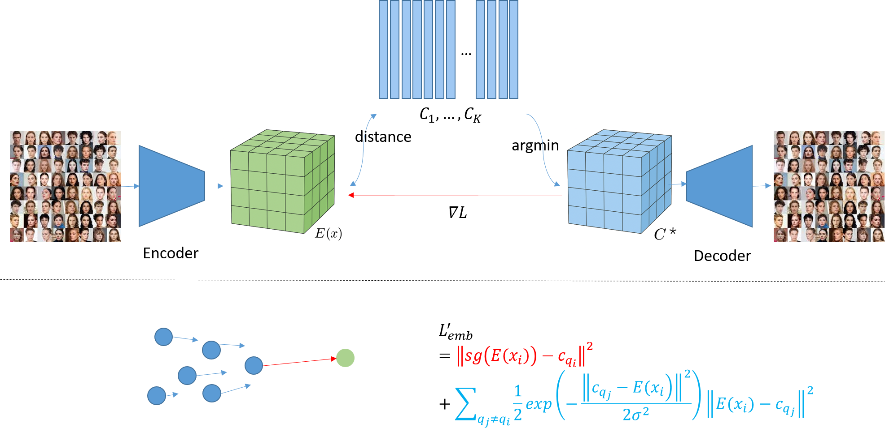
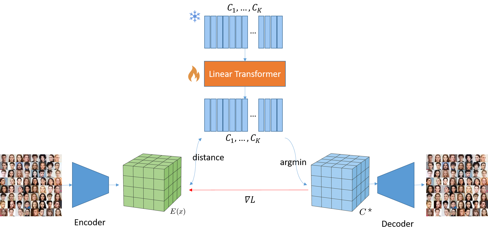

# NS-VQ & TransVQ: Solving Codebook Collapse in VQ-VAE

## 1. Overview

Vector Quantization (VQ) is core to VQ-VAE, VQ-GAN, and diffusion models. However, **codebook collapse** remains a fundamental issue — many latent codes never get used due to **encoder non-stationarity**, leading to degraded reconstruction and poor model capacity.

### ✅ What we solve
- Identify **encoder non-stationarity** as the root cause of codebook collapse
- Provide **theoretical and practical** fixes

### ✅ Our contributions
| Component | Idea | Benefit |
|---|---|---|
| **NS-VQ** | Kernel-based updates propagate drift to unused codes | Prevents collapse, stabilizes training |
| **TransVQ** | Tiny transformer updates entire codebook jointly | Global consistency, preserves k-means fixed point |

> Both modules are **drop-in replacements** for standard VQ layers in Taming + LDM pipelines.

---

## 2. NS-VQ & TransVQ Architecture

### NS-VQ: Cross-Code Drift Propagation

### TransVQ: Transformer-Based Codebook Adaptation

---

## 3. Toy Demo — Why Non-Stationarity Breaks VQ

Codebook collapse emerges when encoder features drift faster than codebook updates can track them.

| Translation Drift | Shrinking Distribution |
|---|---|
| <video src="./figures/demo_videos/translate.mp4" width="400" controls></video> | <video src="./figures/demo_videos/shrink.mp4" width="400" controls></video> |

> NS-VQ + TransVQ remain stable and maintain **near-100% code usage** under extreme drift.

---

## 4. Key Reconstruction Results

<table>
<tr>
<td align="center"><b>Ground Truth</b></td>
<td align="center"><b>VQ-VAE-2 (EMA)</b></td>
<td align="center"><b>VQ-VAE</b></td>
<td align="center"><b>NS-VQ</b></td>
<td align="center"><b>TransVQ</b></td>
</tr>
<tr>
<td></td>
<td></td>
<td></td>
<td></td>
<td></td>
</tr>
</table>

> **Our methods improve visual quality and eliminate codebook collapse.**

---

## ⭐ Highlights

- **~100% codebook utilization**
- Robust to **encoder drift / distribution shift**
- **Plug-and-play** for diffusion/VQ-VAE pipelines
- Improves **LPIPS**, **SSIM**, **FID**

---

Thank you for reading! 🙌  
Feel free to reach out for collaboration or questions.
